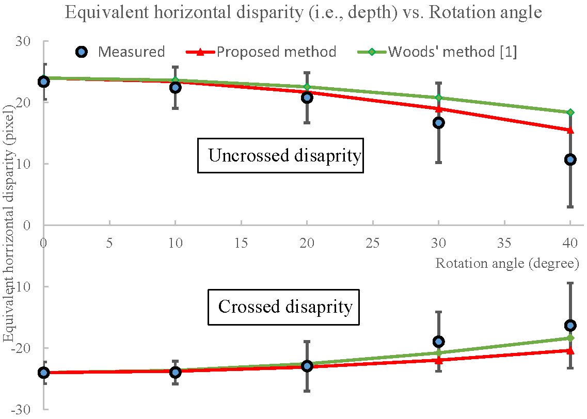

# Extended geometric models for stereoscopic 3D with vertical screen disparity

## Abstract
Geometric models are tools to analyze geometric distortions in S3D viewing. For standard geometric models, 3D perception is predicted by calculating the intersection between the two projection lines from the left and right eye to two corresponding onscreen points. However, standard geometric models fail in two conditions: 1) S3D images are captured by converged cameras (toe-in) and displayed on a flat screen; 2) the viewer's head is rotated about the vertical axis (yaw) or depth axis (roll) relative to the screen. In these two cases, vertical screen disparity with respect to the viewer is introduced. In this paper, we extend standard geometric models to cover the conditions with vertical screen disparity. To test our models, we conduct experiments using random-dot stereograms (RDS) with vertical screen disparities introduced by rotating RDS images. Experimental results show that the perceived depth is well predicted by the proposed model when the rotation angle is smaller than 20 deg. In addition, this paper introduces a retinal eccentricity model to analyze geometric distortions from the viewer's perspective, which indicates that the geometric distortions only affect the binocular depth cue and not monocular depth cues. The monocular-binocular depth cue conflicts may induce motion sickness in S3D viewing.

 
<p align="center">  </p>

	
### (1) Setup
This code has been tested with Matlab with Psychtoolbox
 
- Clone the repository 
```
git clone https://github.com/Gaozhongpai/
ExtendedGeometric3D && cd 
ExtendedGeometric3D
```
